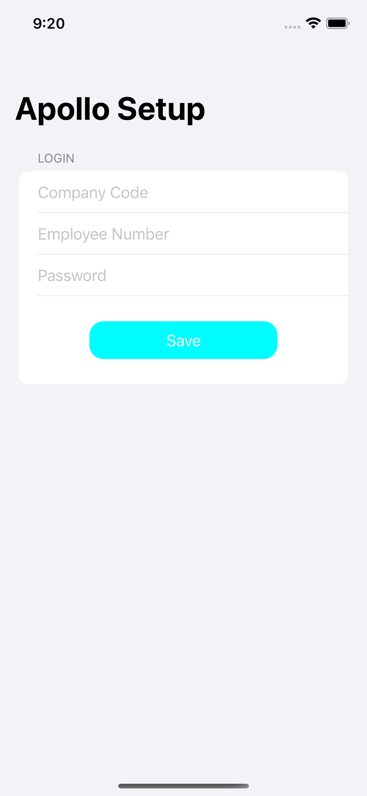
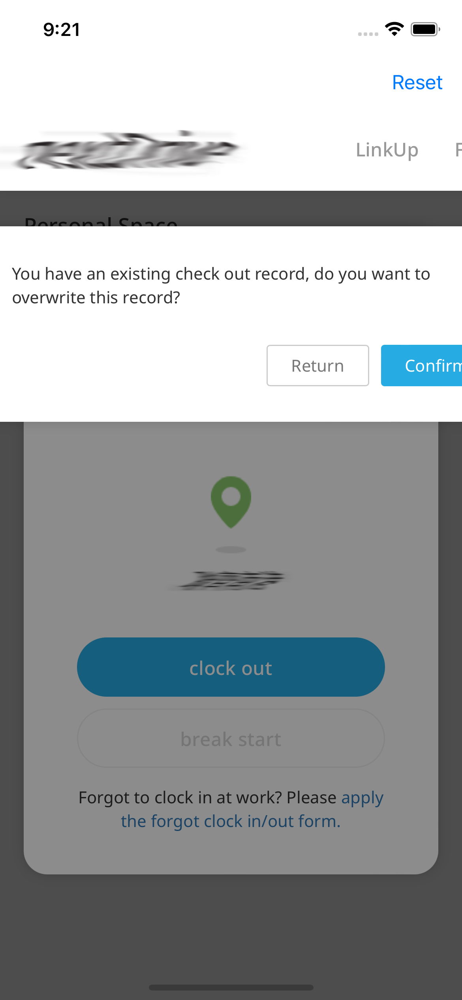

# Apollo

## Description
This project is an iOS App and it can punch card automatically on Apollo HR website.

## Installation
1. Install the latest [Xcode developer tools](https://developer.apple.com/xcode/downloads/) from Apple.
1. Clone the repository:
    ```shell
    git clone https://github.com/heretse/Autopollo
    ```
1. Open `Autopollo.xcodeproj` in Xcode.
1. Build the `Autopollo` scheme in Xcode.

## Usage

1. Launch the App and setup your company code, employee ID and password to login Apollo HR.

    Note: The settings is only store with Dictionary in UserDefaults
    
    

1. Relaunch the App and you can check the login progress out.

    

1. You can reset the login settings by tap the `Reset` button on the top-right side.

    

## License

The MIT License (MIT)
